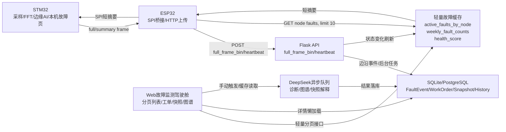

# EdgeWind 故障监测页面可行性评估与设计文档

## 1. 结论

当前设计可以实现，但不能按附件原方案“ESP32 从 Web 定期拉全场故障列表再下发 STM32”直接做。EdgeWind 当前上传量较大，`/api/node/full_frame_bin` 已承担二进制 full frame 解码、降采样、active node 更新、快照候选处理、SocketIO 推送和后台数据库任务提交；新增故障监测功能必须避开上传热路径。

第一版建议拆成两层：

- **STM32 端故障监测页**：800x480 本机/本节点故障告警页，显示当前故障、最近本机事件、确认/静音、同步状态。
- **Web 端故障监测驾驶舱**：全局活跃故障、分级预警、工单、快照、DeepSeek 诊断和知识图谱，继续承担深度分析。

核心边界：

- DeepSeek 只做 Web 端异步辅助解释。
- DeepSeek 不进入 STM32 实时判定、上传热路径、声光报警、确认、复位或安全闭环。
- STM32 端最多显示 Web 已缓存好的短建议，不等待 AI 任务。

## 2. 现状与约束

### 2.1 上传链路现状

当前 `/api/node/full_frame_bin` 支持 full 二进制上报，raw 侧仍保持 `4096` 点波形和 `2048` 点 FFT。服务端会将 UI 推送点数限制在前端可承受范围，例如 `1024/512`。

上传处理链路已经包含：

- 二进制 body 读取和解码。
- 4 路主通道波形/FFT 及 aux4 指标解析。
- active node 内存状态更新。
- 故障状态边沿检测。
- 快照候选生成。
- SocketIO `node_status_update` / `monitor_update` 节流推送。
- HistoryData、Device、WorkOrder、FaultSnapshot 等后台数据库任务提交。

因此新增故障监测功能不能在每帧上传中做同步查询、统计、AI 调用、知识图谱构建或完整故障列表拼装。

### 2.2 当前数据模型约束

现有模型可支撑演示级故障监测，但长期多节点高频运行存在不足：

- `Device` 只能表示当前单一 `fault_code` 和心跳状态。
- `WorkOrder` 当前既承担工单流程，也被用作故障事件日志。
- `FaultSnapshot` 适合详情页证据分析，不适合首页直接查询全量波形/FFT。
- `HistoryData` 适合健康度趋势，但长期高频写入会膨胀。
- `AIAnalysisTask` 已能做 DeepSeek 缓存和审计，但缺少独立故障事件关联。

### 2.3 故障码合同

第一版必须以仓库现有故障码合同为准：

| 故障码 | 含义 |
| --- | --- |
| E00 | 正常 |
| E01 | 交流窜入 |
| E02 | 绝缘故障 |
| E03 | 电容老化 |
| E04 | 电压异常 |
| E05 | 直流母线接地 |
| E06 | 通信/系统类异常 |

附件示例中的 `E02=直流母线接地`、`E05=电容老化预警` 必须修正，否则 Web 工单、知识图谱、DeepSeek 推理和 STM32 页面会错位。

## 3. 总体架构



关键原则：

- 上传链路只负责“采集数据进入系统”和“轻量命令返回”。
- 故障监测页读取缓存或分页接口，不扫全量表。
- AI 只在工单/快照/运维摘要等低频动作中异步运行。
- STM32 端只展示本机相关短摘要，不展示全场站大列表。

## 4. 功能设计

### 4.1 STM32 端故障监测页

定位：现场侧快速告警和确认入口。

显示内容：

- 当前故障码、故障名称、严重等级、发生时间、AI/本地模型置信度。
- 最近 3-5 条本机故障事件。
- 每条卡片显示故障码、名称、状态、关键证据、简短建议。
- 云同步状态：已上报、待上报、网络异常、AI 建议状态。
- 空状态：系统正常、最近同步时间、当前健康度。

交互：

- 返回 Aurora 主界面。
- 查看详情：弹出本机短详情，不展示长篇 AI 文本。
- 确认/静音：只表示现场人员已查看或关闭蜂鸣，不代表故障恢复。
- 刷新：读取本地缓存或 ESP32 最新短摘要。

禁止项：

- 不提供“消除故障”按钮。
- 不显示全场站故障列表。
- 不显示 DeepSeek 长文本、知识图谱、波形大图。
- 不使用 emoji 字符，避免字体缺字；使用已有图标资源、颜色条和中文标签。

接入方式：

- 接入当前 Aurora 主界面 `custom/scr_aurora.c`。
- 将“故障监测”卡片回调从 `NULL` 改为 `nav_fault_monitor`。
- 新建轻量 LVGL 页面，不恢复旧 GUI-Guider Main 网格。

### 4.2 Web 端故障监测驾驶舱

定位：运维中心侧深度诊断和全局状态汇总。

页面能力：

- 全局活跃故障卡片。
- 高/中/低分级统计。
- 最近恢复故障。
- 设备健康度。
- 工单状态入口。
- 快照证据入口。
- DeepSeek 诊断和知识图谱入口。

性能约束：

- 使用服务端分页、过滤、排序。
- 首屏只加载活跃故障和统计摘要。
- 详情、快照、AI、知识图谱全部懒加载。
- 不在列表页渲染大波形和 3D 图谱。

### 4.3 DeepSeek 辅助诊断

DeepSeek 适合：

- 工单根因解释。
- 快照证据摘要。
- 知识图谱推理叠加。
- 24 小时运维简报。
- 给 STM32 页面提供已缓存的 `root_cause/advice_short/ai_status`。

DeepSeek 不适合：

- 实时故障码判定。
- 严重等级实时计算。
- 声光报警触发。
- 设备复位或参数修改。
- 最终安全许可。
- 每次 full frame 上传触发分析。

AI 状态字段建议：

```text
disabled | none | pending | ready | failed | stale
```

## 5. API 设计

### 5.1 Web 页面接口

#### `GET /api/fault_monitor/summary`

用途：Web 驾驶舱顶部统计。

返回字段：

```json
{
  "success": true,
  "active_count": 2,
  "severity_counts": {"high": 1, "medium": 1, "low": 0},
  "weekly_counts": {"high": 2, "medium": 5, "low": 12},
  "health_score": 82,
  "updated_at": "2026-07-02T14:23:00+08:00"
}
```

#### `GET /api/fault_monitor/events?status=active,acknowledged,recovered&limit=50&cursor=...`

用途：Web 故障卡片列表。

要求：

- 服务端分页。
- 默认 `limit=50`。
- 最大 `limit=100`。
- 支持按状态、设备、故障码、时间范围过滤。
- 不返回波形、FFT、知识图谱大对象。

返回字段：

```json
{
  "success": true,
  "items": [
    {
      "fault_id": 123,
      "work_order_id": 456,
      "device_id": "NODE_003",
      "fault_code": "E02",
      "canonical_code": "E02",
      "severity": "high",
      "status": "active",
      "description": "绝缘故障",
      "root_cause": "绝缘电阻下降，需复核接地链路",
      "advice_short": "检查馈线绝缘与接地点",
      "ai_status": "ready",
      "detected_at": "2026-07-02T14:23:00+08:00",
      "updated_rev": 9821
    }
  ],
  "next_cursor": "9821",
  "has_more": true
}
```

#### `GET /api/fault_events/<id>`

用途：打开详情时懒加载。

返回：

- 故障卡片详情。
- 关联工单摘要。
- 快照元数据摘要。
- 最近历史窗口统计。
- AI 结果摘要状态。

不直接返回完整 4096 点波形和 2048 点频谱。

#### `POST /api/fault_events/<id>/ack`

用途：确认已查看。

行为：

- 只将事件状态改为 `acknowledged`。
- 可同步将关联工单从 `pending` 推进到 `processing`。
- 不改变设备真实 `fault_code`。
- 不清除故障。

#### `POST /api/fault_events/<id>/ignore`

用途：低优先级预警忽略/静音。

行为：

- 只记录操作审计和 UI 状态。
- 不改变设备真实 `fault_code`。
- 不影响后续再次故障上报。

### 5.2 设备侧轻量接口

#### `GET /api/node/faults?node_id=<id>&since_rev=<rev>&limit=10`

用途：ESP32/STM32 获取本节点故障摘要。

要求：

- 使用设备 API key 鉴权。
- 不走用户 Cookie/CSRF。
- 默认 `limit=10`，最大 `limit=10`。
- 支持 `since_rev`，无变化可返回 `not_modified`。
- 响应体必须小，适合 ESP32 转发给 STM32。

返回字段：

```json
{
  "success": true,
  "node_id": "NODE_003",
  "fault_epoch": 9821,
  "items": [
    {
      "fault_id": 123,
      "fault_code": "E02",
      "canonical_code": "E02",
      "severity": "high",
      "timestamp": 1782982980,
      "description": "绝缘故障",
      "root_cause": "绝缘电阻下降",
      "advice_short": "检查馈线绝缘",
      "status": "active",
      "ai_status": "ready",
      "updated_rev": 9821
    }
  ]
}
```

### 5.3 SocketIO

新增事件：`fault_delta`

触发时机：

- `E00 -> E0X` 新故障。
- `E0X -> E00` 恢复。
- 工单确认/忽略/状态变化。

限制：

- 只推摘要字段。
- 不带波形、FFT、快照详情、AI 长文本。
- 不替代分页接口，断线重连后仍通过 HTTP 拉取当前状态。

## 6. 数据模型

### 6.1 第一版策略

短期演示可以复用 `WorkOrder`，但新增轻量接口必须分页，并用缓存避免全表扫描。

### 6.2 正式策略

新增 `FaultEvent` 表：

```text
id
event_key
device_id
fault_code
severity
state
detected_at
ack_at
ignore_at
recovered_at
root_cause
recommendation
work_order_id
latest_ai_task_id
updated_rev
created_at
updated_at
```

状态建议：

```text
active | acknowledged | ignored | recovered
```

`WorkOrder` 保持：

```text
pending | processing | resolved
```

映射规则：

- `FaultEvent.active` 可对应 `WorkOrder.pending`。
- `FaultEvent.acknowledged` 可对应 `WorkOrder.processing`。
- `FaultEvent.recovered` 不必自动等于 `WorkOrder.resolved`，工单完成仍需人工确认。

### 6.3 索引建议

```text
fault_events(device_id, state, updated_rev)
fault_events(state, detected_at DESC)
fault_events(fault_code, detected_at DESC)
work_orders(status, fault_time DESC)
work_orders(device_id, fault_time DESC)
fault_snapshots(device_id, fault_code, timestamp DESC, snapshot_type, channel_id)
history_data(device_id, timestamp DESC)
ai_analysis_tasks(task_type, target_key, model, prompt_version, status, created_at DESC)
devices(last_heartbeat)
```

### 6.4 缓存建议

内存 TTL 缓存：

- `active_faults_by_node`
- `weekly_fault_counts`
- `device_health_cache`
- `last_fault_event_rev`

刷新策略：

- 故障新增/恢复时立即刷新相关节点缓存。
- ack/ignore 时立即刷新。
- 统计类缓存最多 1 秒懒刷新一次。
- 服务重启后可从数据库重建。

## 7. 上传热路径保护规则

以下行为禁止出现在 `/api/node/full_frame_bin` 和 `/api/node/heartbeat` 同步路径中：

- 查询全量 `WorkOrder`。
- 查询全量 `/api/faults`。
- 计算周统计和健康度聚合。
- 调用 DeepSeek 或外部 HTTP。
- 构建知识图谱。
- 返回完整故障列表。
- 返回快照、波形、FFT 或 AI 长文本。
- 每帧新增全局 SocketIO 广播。

允许行为：

- 保持现有故障码状态边沿检测。
- 在 `E00 -> E0X` 时提交后台建单/建事件任务。
- 更新内存轻量状态。
- 返回已有轻量配置命令。
- 节流推送 `node_status_update` 和当前订阅节点 `monitor_update`。

## 8. 性能目标

| 项目 | 目标 |
| --- | --- |
| full 上传 payload | 约 `49348 bytes` |
| raw 上传能力 | `4096` waveform / `2048` FFT |
| Web UI emit | 不超过 `1024` waveform / `512` FFT |
| `/api/node/full_frame_bin` 单节点 | p95 < 80 ms |
| `/api/node/full_frame_bin` 压力 | p95 < 150 ms, p99 < 300 ms |
| ESP32 HTTP 成功率 | >= 99.5% |
| full 上报空窗 | 不出现连续 5 秒以上 |
| Web 故障页 1 万条首屏 | p95 <= 1 s |
| Web 筛选/搜索 | p95 <= 150 ms |
| STM32 页面加载 | < 200 ms |
| STM32 10 条卡片刷新 | < 50 ms |
| STM32 触摸反馈 | < 100 ms |
| AI 提交接口 | < 300 ms 返回 |

## 9. 降级策略

上传压力过高：

- full -> summary。
- `upload_points` 从 `4096` 降到 `1024` 或 `256`。
- `fft_enabled=0`。
- 降低 `EDGEWIND_MONITOR_EMIT_HZ`。

Web 压力过高：

- 保持 `LIGHT_ACTIVE_NODES=true`。
- 故障列表只保留分页首屏。
- 关闭自动 AI 图谱：`EDGEWIND_AI_AUTO_GRAPH_ON_FAULT=false`。

AI 不可用：

- `DEEPSEEK_ENABLED=false`。
- 页面显示本地专家库建议。
- `ai_status=disabled/failed`。
- 不影响上传、工单、故障列表。

STM32 页面异常：

- “故障监测”入口可临时回退为 `NULL`。
- 保持实时监控、通讯配置、服务器配置等既有页面不受影响。

## 10. 测试计划

### 10.1 后端测试

- 新接口分页、过滤、游标、鉴权。
- `GET /api/node/faults` 设备 API key 鉴权。
- `E00 -> E0X` 只创建一个故障事件和一个工单。
- ack/ignore 不改变真实未恢复故障。
- 上传接口不查询全量工单。
- 上传接口不调用 DeepSeek。
- 上传响应不新增大字段。
- 队列满、数据库忙、AI 关闭时故障列表仍可用。

### 10.2 Web 前端测试

- 200、1000、10000 条故障记录下首屏、筛选、刷新、分页。
- `fault_delta` 增量插入顶部。
- 详情懒加载 AI、快照、知识图谱。
- 30 分钟运行后 JS heap 增长 <= 30%。
- 监控页和故障页同时打开无明显卡顿。

### 10.3 STM32 测试

- 静态数组验证 0/1/2/10/20 条故障显示。
- 中文字体正常。
- 图标资源正常。
- 长文本截断正常。
- 滚动不卡顿。
- 详情弹窗正常。
- 返回 Aurora 正常。
- 连续点击确认/静音不重复下发 ACK。
- 页面切换 30 分钟无 LVGL 内存增长和任务饥饿。

### 10.4 三端联调

- full 4096 + FFT 2048 连续 20 分钟。
- 验收：
  - `stm_http_fail=0`
  - `stm_full_timeout=0`
  - `stm_long_frame_intervals_gt5s=0`
  - `esp_http_success_rate >= 99.5%`
  - `cloud_errors=0`
- 同时打开 Web 监控页和故障监测页。
- 验证 raw 上传保持 `4096/2048`，UI emit 保持 `1024/512`。

## 11. 实施顺序

1. **故障码合同修正**
   - 统一 E00-E06 名称、严重度、短描述。
   - 修正附件示例和 UI 文案中的 E02/E05 错位。

2. **Web 轻量接口**
   - 新增 summary/events/node faults 接口。
   - 加分页、limit、设备鉴权。
   - 加轻量缓存。

3. **Web 故障监测驾驶舱**
   - 首屏只显示活跃故障和统计。
   - 详情懒加载。
   - 用 `fault_delta` 增量更新。

4. **STM32 静态页面**
   - 先用本地静态数组验证 UI。
   - 接入 Aurora 卡片。
   - 验证字体、图标、页面切换。

5. **ESP32/STM32 轻量数据闭环**
   - ESP32 拉取本节点短摘要。
   - SPI 转发给 STM32。
   - STM32 更新本机卡片。

6. **AI 缓存接入**
   - Web 端异步生成建议。
   - STM32 端只显示 `ready/stale` 的短建议。

7. **压力和三端验收**
   - 90 秒 smoke。
   - 20 分钟 soak。
   - 保留日志和截图用于中期报告/PPT。

## 12. 验收结论

在不增加上传热路径负担、不让 DeepSeek 进入实时闭环、不让 STM32 拉全场站故障列表的前提下，该设计可以支撑当前 EdgeWind 的大上传量演示和中期报告展示。

第一版最稳妥的实现范围是：

- Web 轻量故障监测接口。
- Web 活跃故障驾驶舱。
- STM32 本机故障监测页。
- 设备侧本节点短摘要同步。
- DeepSeek 已缓存短建议展示。

暂不做：

- STM32 全场站故障列表。
- STM32 DeepSeek 实时诊断。
- 上传响应夹带完整故障数据。
- 自动消除故障或自动执行设备控制。

## 13. 当前实现状态（2026-07-05）

已实现并部署到本项目 Web/RK3588S 网关：

- `FaultEvent` 数据模型。
- `/api/node/faults?node_id=<id>&since_rev=<rev>&limit=10&compact=1`。
- `/api/fault_monitor/summary`。
- `/api/fault_monitor/events`。
- `/api/fault_events/<id>`。
- `/api/fault_events/<id>/ack`。
- `/api/fault_events/<id>/ignore`。
- `/fault-monitor` Web 轻量故障监测页。
- `/api/node/faults` 服务器时间字段：`server_time_unix`、`server_time_local`、`server_time_utc`、`server_tz_offset_minutes=480`。
- ESP32 低频故障短摘要 GET 与 STM32 `TIME_SYNC(0x45)` 链路。
- STM32 Aurora 故障监测/历史记录相关页面和 SD 故障日志链路处于联调状态。

RK3588S 当前部署：

```text
/opt/edgewind/current
/opt/edgewind/releases/20260705-1906-svg-toast-icons/Edge_Wind_System
edgewind-gateway.service
```

已验证：

```text
/overview = 200
/monitor = 200
/fault-monitor = 200
/api/node/faults?node_id=TEST&since_rev=0&limit=10&compact=1 = 200
ESP32 POST /api/node/full_frame_bin = 200
```

当前 Web 通知弹窗已改为内联 SVG 彩色图标，不依赖 emoji 字形或 Bootstrap Icons 字体，避免 RK3588S 本机浏览器字体缺失时显示方框。

仍需后续实机验收：

- STM32 SD 故障日志的真实故障发生/恢复落盘。
- 历史记录页按最近/今天/前一天/后一天查询 SD `fault.log`。
- ESP32 故障摘要同步长期运行对 full 上传 p95/p99 的影响。
- 90 秒 smoke 和 20 分钟三端 soak。
